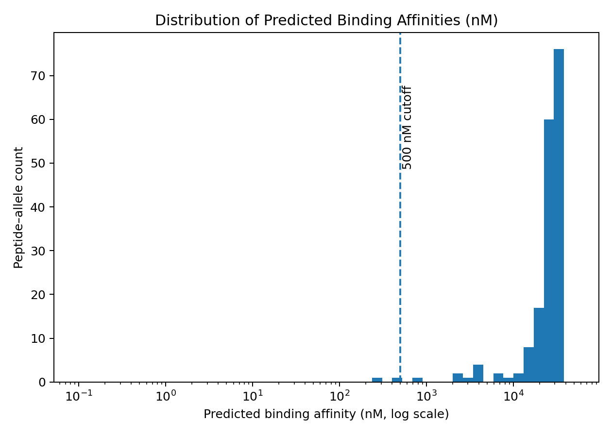
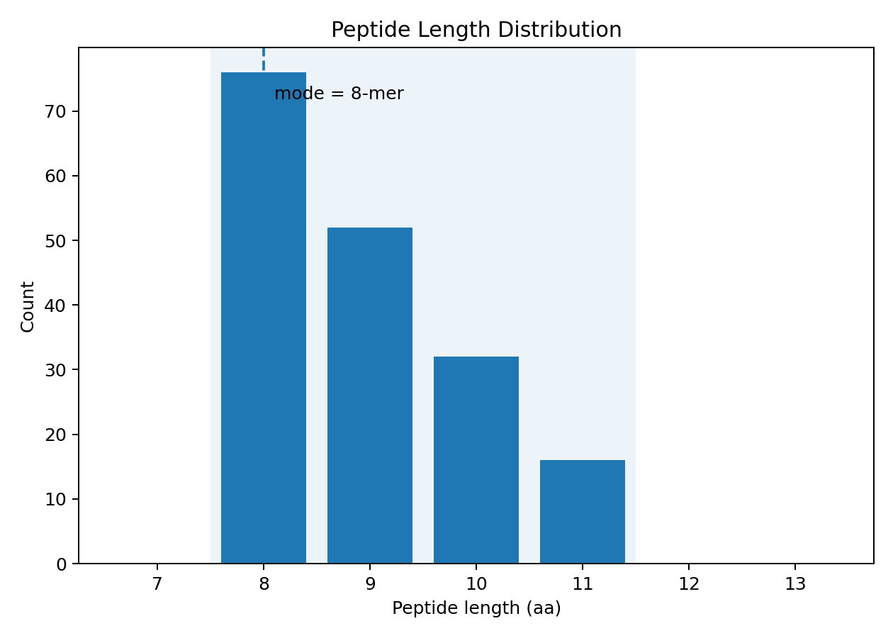
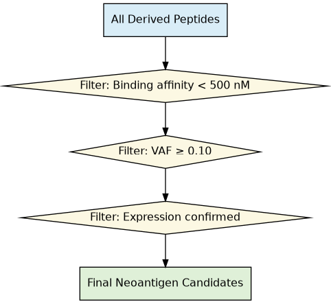

# Phase 2 · Neoantigen Prediction Pipeline (Mini README)

Predict patient-specific neoantigen candidates using *MHCflurry* binding + presentation, then apply biological filters.

---

## Inputs
- inputs/variant_info/somatic_mutations.tsv
- inputs/variant_info/mutations_with_expression.tsv
- inputs/expression/expression_tpm.tsv
- inputs/hla/hla_types.tsv

---

## Method (quick)
1) Derive 8–11mer peptides from expressed mutations  
2) Predict:
   - Binding affinity (MHCflurry)
   - Processing / presentation (MHCflurry presentation models)
3) Filter: *affinity < 500 nM, **VAF ≥ 0.1, **expression confirmed*
4) QC plots

---

## Outputs
- work/neoantigen_candidates.tsv (n=2)
- work/mhcflurry_binding.tsv (rows=176)
- results/binding_affinity_histogram.png ✅
- results/peptide_length_distribution.png ✅
- results/peptide_filtering_flowchart.png ✅

---

## Quick preview
  
  

---

_This file is auto-generated by scripts/make_phase2_readme.py._
